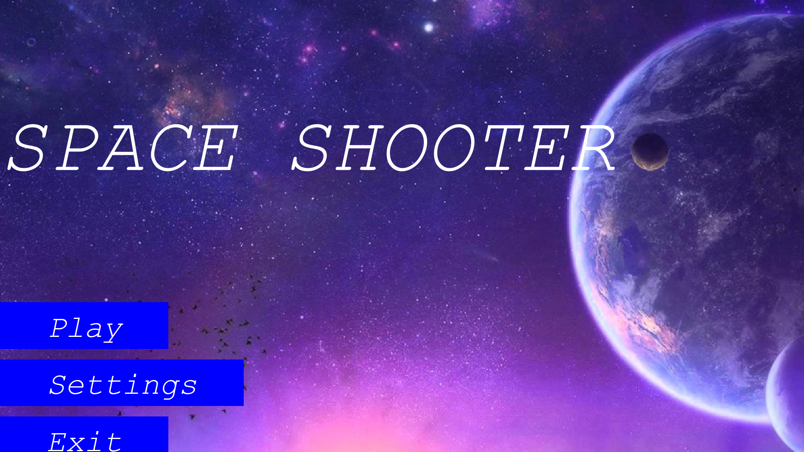
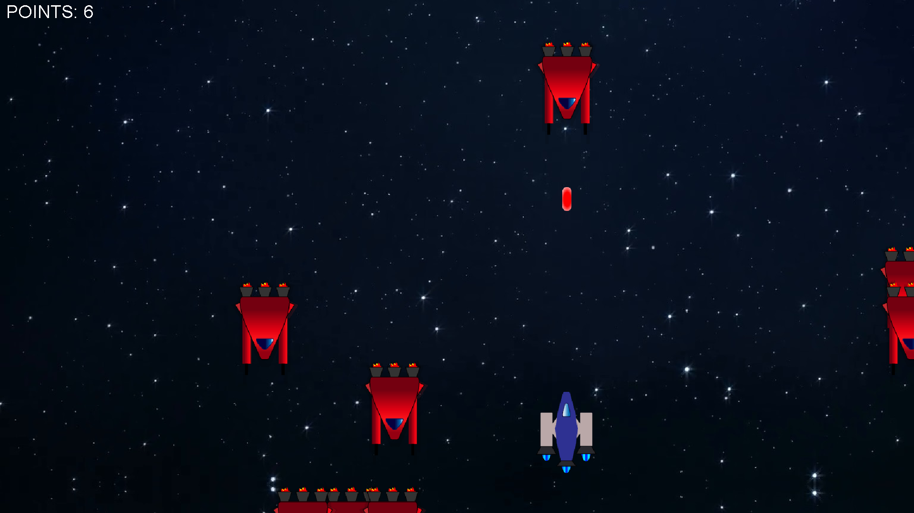
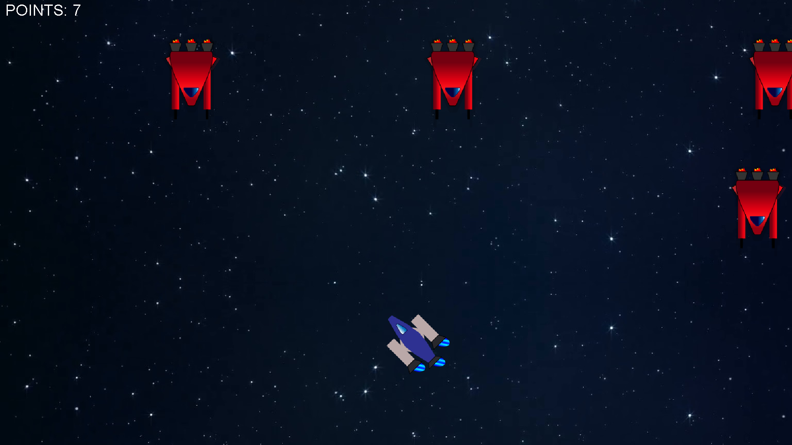

# SpaceShooterGame

Gra jest projektem uczelnianym na zaliczenie przedmiotu. Polega na zestrzeliwaniu przeciwników (wrogich statków) celując i poruszając się po planszy. Jest to gra typu *Shoot'em up (STG)* z widokiem z góry i przesuwającą się planszą z góry do dołu. Projekt wykorzystuje takie elementy jak **interaktywne GUI, muzykę, reakcje na kolizje i sprite**, czyli silnik gry odświeżający obraz. Gra została wykonana w zespole dwuosobowym. Wszystkie klasy znajdują się w folderze *src/Classes/*. Program można uruchomić za pomocą pliku .jar.

The game is a university project to pass the course. It consists in shooting down enemies (enemy ships) by aiming and moving around the board. This is a *Shoot'em up (STG)* game with a top view and a moving board from top to bottom. The project uses elements such as **interactive GUI, music, collision reactions and sprite**, which is game engine to refresh rate. The game was made in a team of two-person. All classes are in folder *src/Classes/*. Program can be started by using the .jar file.

